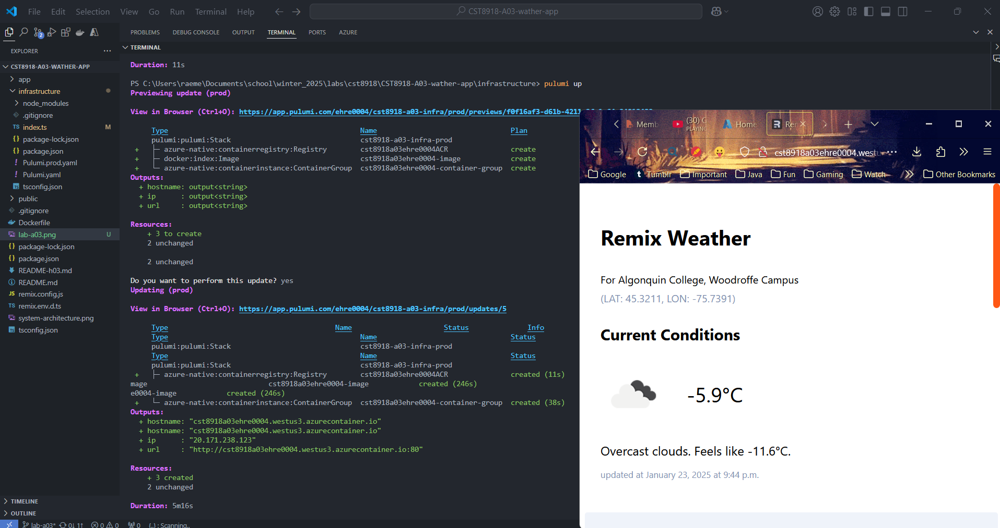
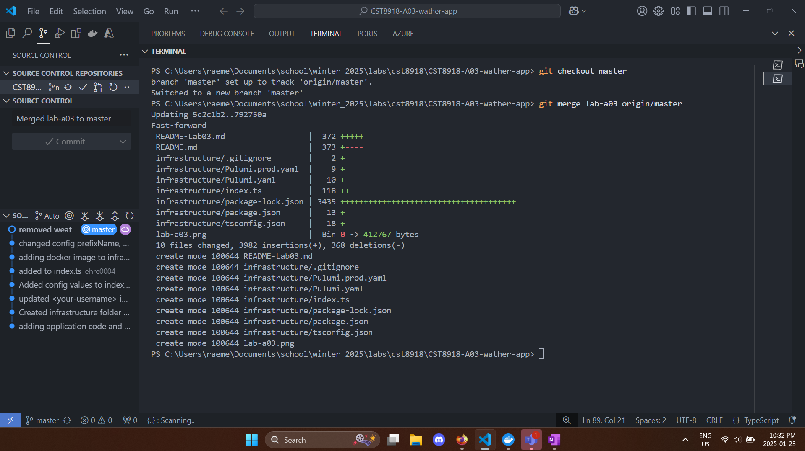
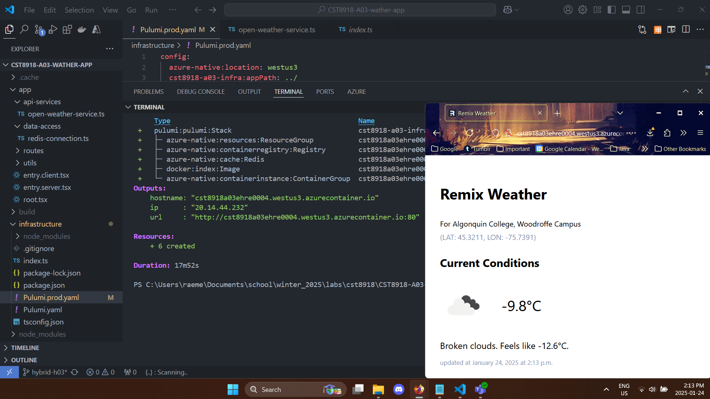

# CST8918 - Lab 3 & Hybrid 3

## Objective

The purpose of this lab is to explore IaC using Pulumi.

## Lab 3

### L03 - Screenshot of application running and results of `pulumi up`

After finishing lab 3, merged branch with master.

## Hybrid 3

### H03 - Screenshot of application running and results of `pulumi up`

